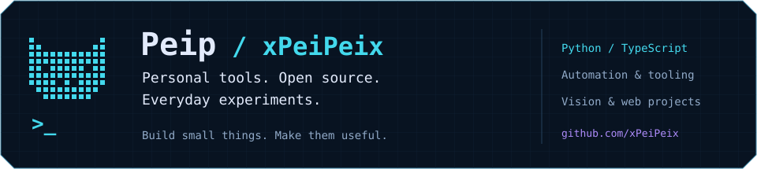
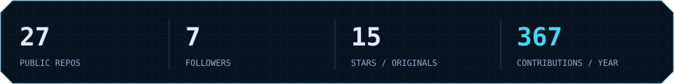
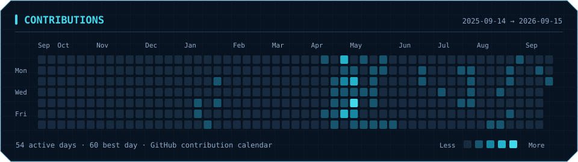
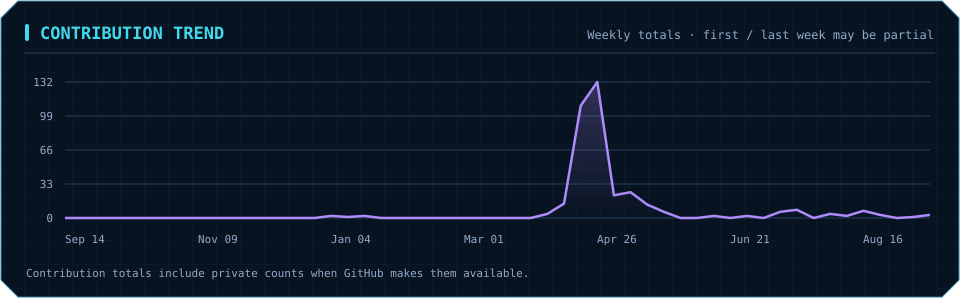
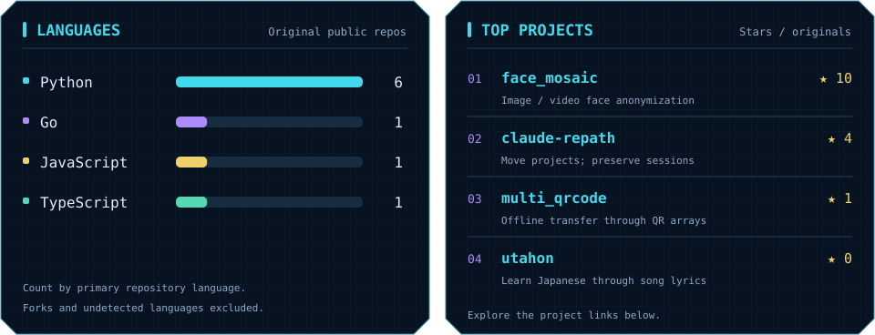
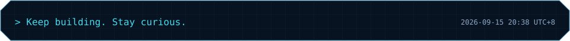

  <picture>
    <source media="(max-width: 600px)" srcset="assets/header-mobile.svg" />
    
  </picture>

  <picture>
    <source media="(max-width: 600px)" srcset="assets/overview-mobile.svg" />
    
  </picture>

  <picture>
    <source media="(max-width: 600px)" srcset="assets/contributions-mobile.svg" />
    
  </picture>

  <picture>
    <source media="(max-width: 600px)" srcset="assets/trend-mobile.svg" />
    
  </picture>

  <picture>
    <source media="(max-width: 600px)" srcset="assets/insights-mobile.svg" />
    
  </picture>

  <a href="https://github.com/xPeiPeix/face_mosaic">face_mosaic</a> ·
  <a href="https://github.com/xPeiPeix/claude-repath">claude-repath</a> ·
  <a href="https://github.com/xPeiPeix/multi_qrcode">multi_qrcode</a> ·
  <a href="https://github.com/xPeiPeix/utahon">utahon</a>

  <picture>
    <source media="(max-width: 600px)" srcset="assets/footer-mobile.svg" />
    
  </picture>

About these numbers

Repository and follower counts come from GitHub. Stars and language counts cover original public repositories, excluding forks. Languages are counted by each repository's primary language, not lines of code. Contributions cover the last year returned by GitHub, including private contribution counts when available; no private repository names or content are published. Weekly totals can include partial weeks.

The dashboard refreshes daily at approximately 08:23 UTC+8. The timestamp shows the last successful update. If a refresh fails, the previous images stay available.

